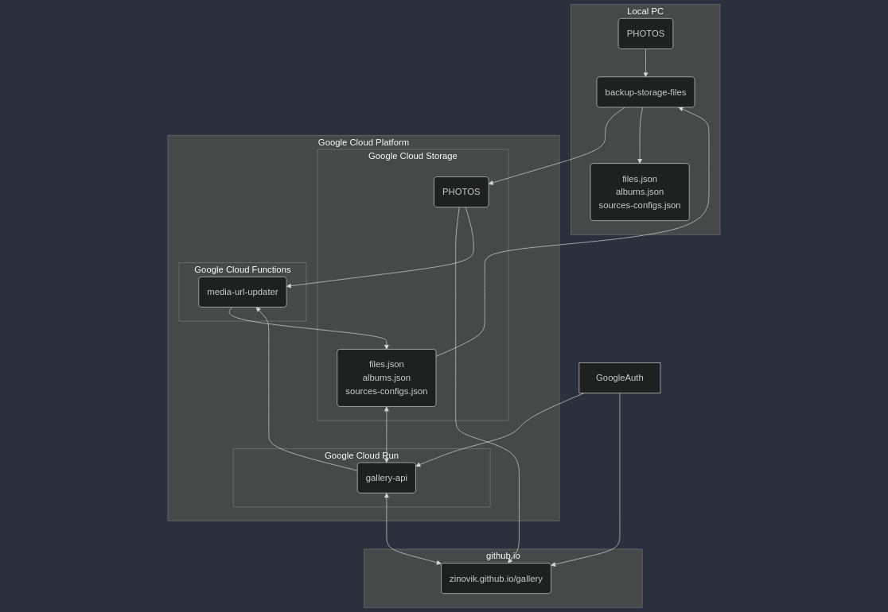

[zinovik.github.io/gallery](https://zinovik.github.io/gallery)



```
flowchart TB

    subgraph github.io
        Gallery(zinovik.github.io/gallery)
    end

    subgraph Local PC
        StorageTools(storage-tools)
        fasLocal(files.json<br/>albums.json<br/>sources-configs.json)
        PhotosLocal(PHOTOS)
    end

    subgraph Google Cloud Platform
        subgraph Google Cloud Storage
            fasStorage(files.json<br/>albums.json<br/>sources-configs.json)
            PhotosStorage(PHOTOS)
        end
        subgraph Google Cloud Run
            GalleryApi(gallery-api)
        end
        GoogleCloudScheduler(Google Cloud Scheduler)
    end

    GoogleAuth

    PhotosLocal --> StorageTools
    fasStorage --> StorageTools
    StorageTools --> PhotosStorage
    StorageTools --> fasLocal

    GoogleAuth --> Gallery
    GoogleAuth --> GalleryApi

    fasStorage <--> GalleryApi
    PhotosStorage --> Gallery

    GalleryApi <--> Gallery

    GoogleCloudScheduler --> GalleryApi
    PhotosStorage --> GalleryApi
```

### create bucket, setup cors, check the bucket's cors:

```bash
gcloud storage buckets create gs://zinovik-gallery --location=europe-central2
gcloud storage buckets update gs://zinovik-gallery --cors-file=cors_file.json
gcloud storage buckets describe gs://zinovik-gallery --format="default(cors_config)"
gcloud storage buckets update gs://zinovik-gallery --versioning
```
